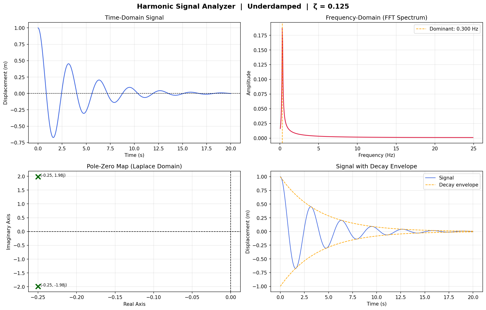
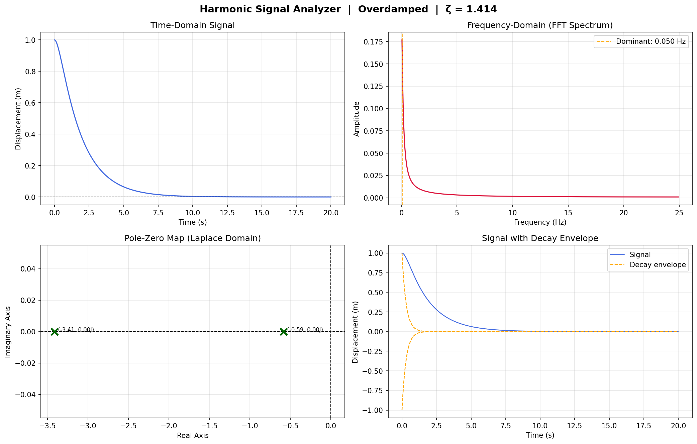

# Harmonic Signal Analyzer

A Python-based signal processing tool that simulates damped harmonic oscillator systems, applies Fourier and Laplace transform techniques, and visualizes results across time and frequency domains.

## Overview

This project bridges **computational physics** and **signal processing** by:

- Numerically solving second-order linear ODEs to simulate oscillator motion
- Applying **Fast Fourier Transform (FFT)** to decompose signals into frequency components
- Using **Laplace Transform** pole-zero analysis to classify system stability
- Generating 4-panel diagnostic plots for every simulation

## Physics Model

The system models a damped harmonic oscillator governed by:

    m·(d²x/dt²) + c·(dx/dt) + k·x = 0

| Parameter | Symbol | Unit |
|-----------|--------|------|
| Mass | m | kg |
| Damping coefficient | c | N·s/m |
| Spring constant | k | N/m |
| Displacement | x | m |

## Sample Output

### Underdamped System (m=1, c=0.5, k=4)

### Overdamped System (m=1, c=4, k=2)

## Project Structure

    Harmonic-Signal-Analyzer/
    │
    ├── src/
    │   ├── physics_engine.py
    │   ├── math_engine.py
    │   └── visualizer.py
    │
    ├── tests/
    ├── outputs/
    ├── main.py
    ├── requirements.txt
    └── README.md

## Setup

    git clone https://github.com/YOUR_USERNAME/Harmonic-Signal-Analyzer.git
    cd Harmonic-Signal-Analyzer

    python -m venv venv
    venv\Scripts\activate

    pip install -r requirements.txt

## Usage

    # Default run
    python main.py

    # Custom parameters
    python main.py --mass 1.0 --damping 0.5 --spring 4.0 --duration 20

    # See all options
    python main.py --help

## CLI Options

| Argument | Default | Description |
|----------|---------|-------------|
| `--mass` | 1.0 | Mass in kg |
| `--damping` | 0.5 | Damping coefficient (N·s/m) |
| `--spring` | 4.0 | Spring constant (N/m) |
| `--x0` | 1.0 | Initial displacement (m) |
| `--v0` | 0.0 | Initial velocity (m/s) |
| `--duration` | 20.0 | Simulation time (s) |
| `--steps` | 1000 | Number of time steps |

## System Classification

| Condition | Damping Ratio (ζ) |
|-----------|-------------------|
| Underdamped | ζ < 1 |
| Critically Damped | ζ = 1 |
| Overdamped | ζ > 1 |

Damping ratio: `ζ = c / (2·√(m·k))`

## Tech Stack

- **Python 3.10+**
- `numpy` — numerical computation
- `scipy` — ODE solver, FFT, transfer function analysis  
- `matplotlib` — visualization
